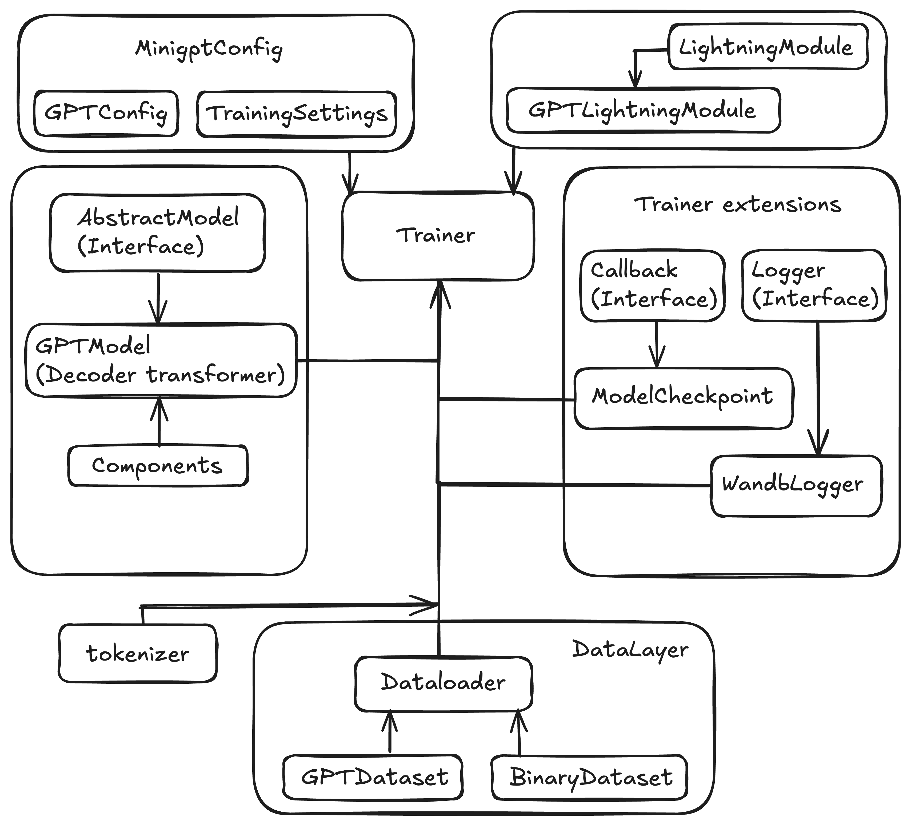
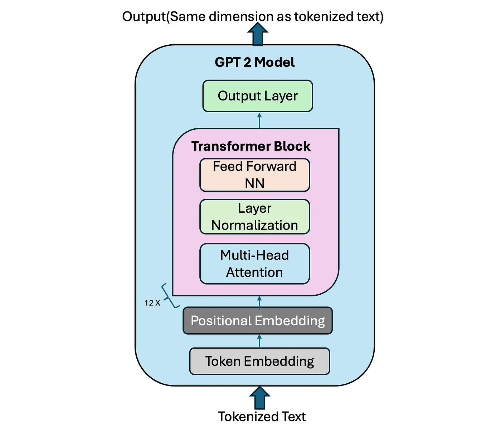

# minigpt

## create virtual environment
```
uv venv
```

## install dependencies 
```
source .venv/bin/activate && uv pip install -e .
```

## run tests 
```
pytest src/minigpt/tests
```

## run experiment 
```
python examples/training.py --config src/minigpt/config/gpt_config.json
```

## Framework architecture



## Model architecture

[Source](https://medium.com/@vipul.koti333/from-theory-to-code-step-by-step-implementation-and-code-breakdown-of-gpt-2-model-7bde8d5cecda)

## Runs 

[Wandb: Redpajama dataset, 100M samples, 124M params transformer](https://wandb.ai/quantcomp/minigpt-training/runs/rzgt7510/workspace?nw=nwuserquantdavidos)


## Relevant resources 
- [LLM from scratch](https://github.com/rasbt/LLMs-from-scratch/blob/main/ch05/03_bonus_pretraining_on_gutenberg/previous_chapters.py)
- [nanoGPT](https://github.com/karpathy/nanoGPT)